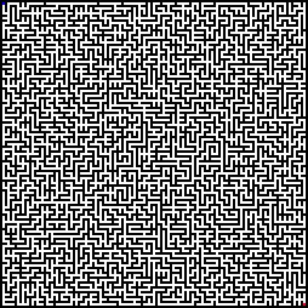

# makemaze

```
Usage:

    $ makemaze

Options:
    -w, --width [default: 1023] - Width of the created maze
    -h, --height [default: 1023] - Height of the created maze
    -s, --scale [default: 1] - Scale of the output image
```

## Examples

```bash
makemaze -w 127 -h 127 -s 4 > maze.png
```


