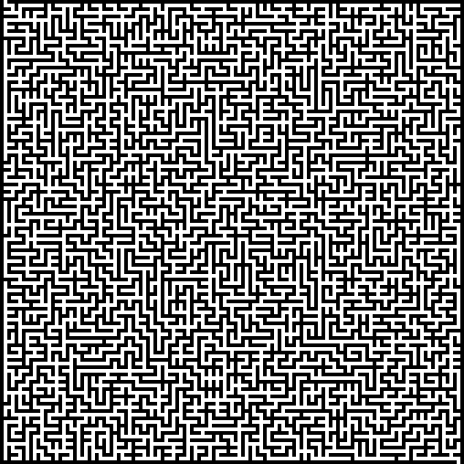

# makemaze

```bash
# Makes a rectangular maze
makemaze <width> <height> > path/to/output/file.png
```

```bash
# Makes a squre maze
makemaze <size> > path/to/output/file.png
```

```bash
# Makes a maze with the default size (1023x1023)
makemaze <size> > path/to/output/file.png
```

## Example

```bash
makemaze 127 > maze.png
```


